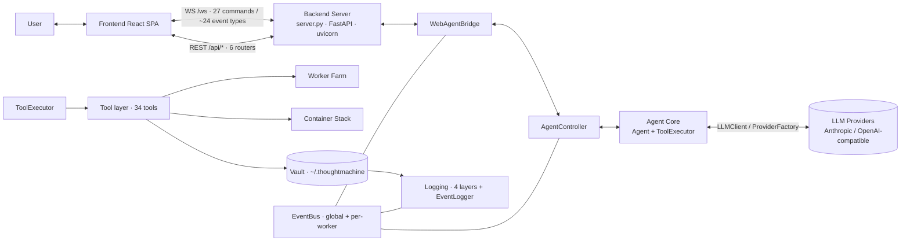
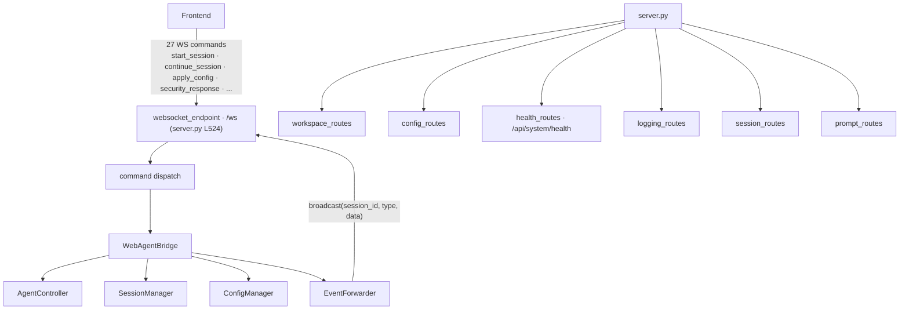
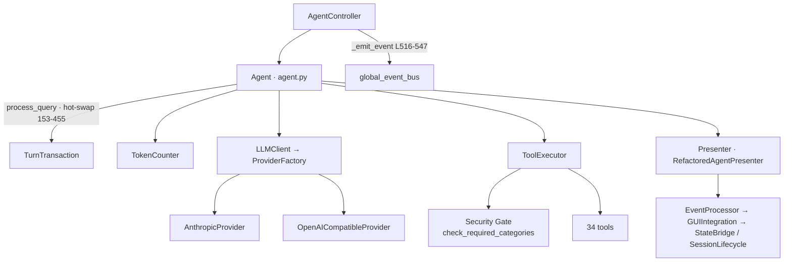
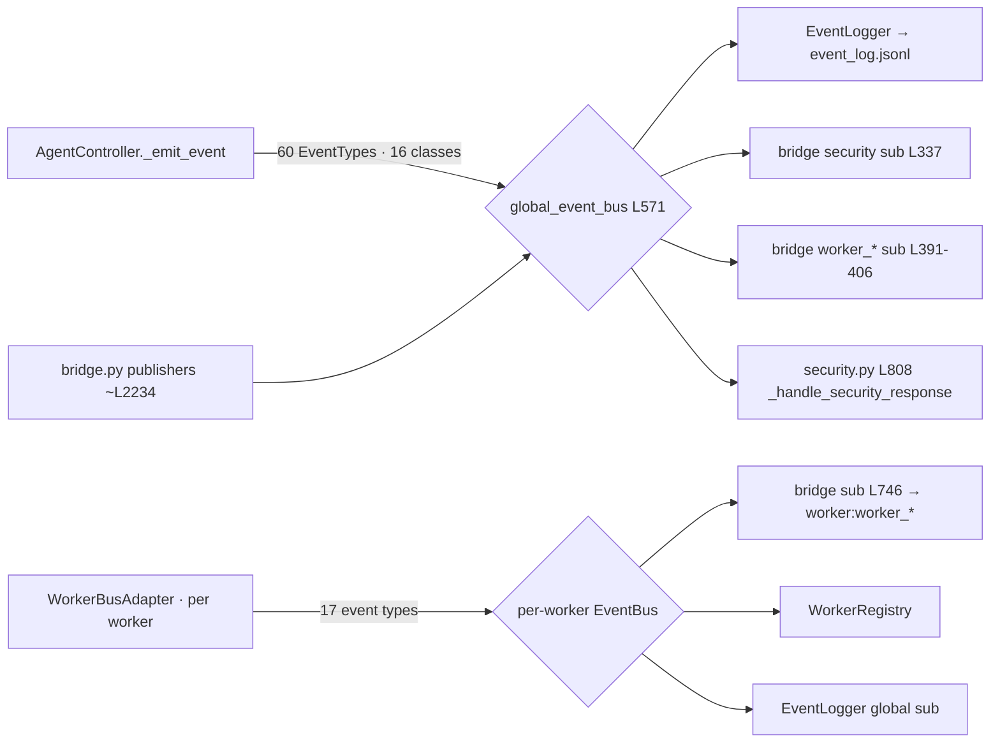
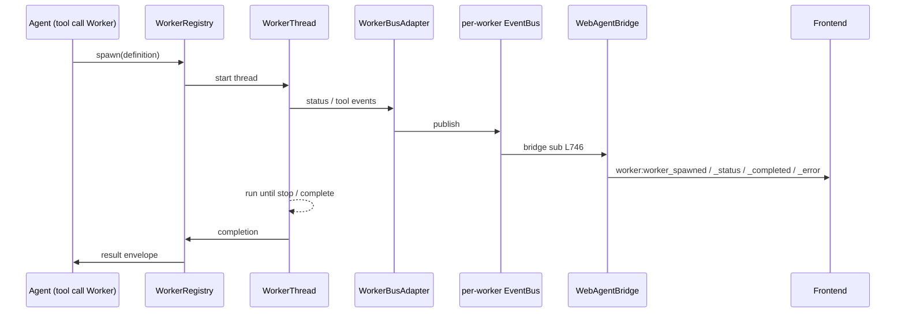
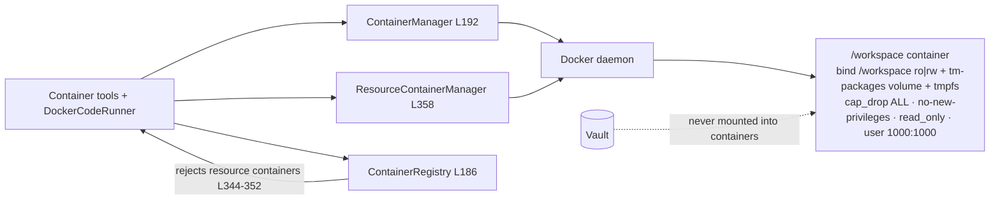
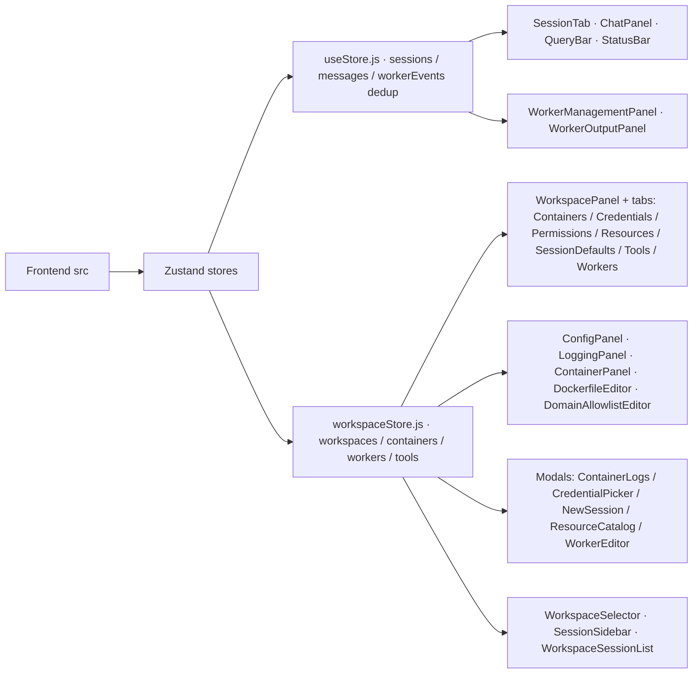

# ThoughtMachine — Architecture Map

> A relational map of the machine: sub-machines, ownership, communication channels, and main pipelines.
> Produced from a full source audit (branch `feat/workspace-panel`). Line references are approximate to the audited revision and will drift.

## Contents
1. System context
2. Sub-machines and ownership
3. Backend internals (server, bridge, session/config, event forwarder)
4. Agent core internals
5. Event flow (two buses, publishers, subscribers)
6. Worker farm lifecycle
7. Container stack
8. Frontend anatomy
9. Communication channels
10. Main pipelines
11. Vault layout
12. Known gaps and flagged items

## 1. System context



## 2. Sub-machines and ownership

| # | Sub-machine | Owns | Key files |
|---|---|---|---|
| S1 | **Backend Core** | HTTP + WS transport, session/config lifecycle, event fan-out to clients | `web_ui/backend/server.py`, `bridge.py`, `session_manager.py`, `config_manager.py`, `event_forwarder.py` |
| S2 | **Agent Core** | Conversation loop, tool dispatch, turn transaction, hot-swap, token accounting | `agent/core/agent.py` (1578 L), `agent/controller/__init__.py`, `agent/core/tool_executor.py`, `agent/core/llm_client.py`, `presenter/` |
| S3 | **Worker Farm** | Worker threads, per-worker event bus, status/context files, lifecycle | `tools/workspace/worker.py`, `worker_registry.py`, `worker_thread.py`, `worker_context.py`, `worker_bus_adapter.py`, `worker_session_lifecycle.py` |
| S4 | **Container Stack** | Container build/exec/status/logs, resource containers, profiles | `infra/container_manager.py`, `infra/container_registry.py`, `infra/resource_container_manager.py`, `tools/container_control.py`, `tools/docker_code_runner.py` |
| S5 | **Security Gate** | Capability checks, permission model, security-prompt round-trip | `thoughtmachine/security.py`, `thoughtmachine/workspace_capabilities.py`, `security/security_gate.py`, `security/sandboxed_execution.py` |
| S6 | **Tool Layer** | 34 tools incl. introspection, KB, MCP clients, git | `tools/base.py` + subclasses; `tools/workspace/check_system.py`, `tools/knowledge_base.py`, `tools/mcp_*.py` |
| S7 | **Logging and Events** | 4 logging layers + EventLogger to event_log.jsonl | `agent/logging/` (unified.py, lifecycle.py, streams.py, console.py, event_logger.py, debug_log_adapter.py), `agent/events.py` |
| S8 | **Vault** | Host-side state: logs, sessions, workspaces, registries | `~/.thoughtmachine/**` (never mounted into containers) |
| S9 | **Frontend** | React SPA: chat, workspace panel, stores | `web_ui/frontend/src/` (App.jsx, stores, components) |

## 3. Backend internals



- **WS** (`server.py:523`): one endpoint `/ws?project=`, 27 client-to-server commands, ~24 server-to-client event types (full list in section 9).
- **Bridge** (`bridge.py:203`): translates WS commands into controller/session/config calls; subscribes global bus (security L337, worker_* L391-406) and per-worker buses (L746); re-emits via `EventForwarder`; also publishes its own events (~L2234).
- **EventForwarder** (`event_forwarder.py:28`): pure callback registry — register/unregister websockets, `send_personal`, `broadcast` per session, static `broadcast_rename`, `broadcast_logging_config`.
- **REST** (`server.py:2229-2235`): 6 routers for workspace/config/health/logging/session/prompt.

## 4. Agent core internals



- **Agent** (`agent/core/agent.py`, 1578 L): the conversation loop. Hot-swap of configuration/context at L153-455; `process_query` at L835; `{{credential:key}}` resolution at L418-442 via `credentials/`.
- **AgentController** (`agent/controller/__init__.py`): drives Agent; publishes to the global bus via `_emit_event` (~L516-547); 4 output sinks (bus, presenter, logs, frontend via bridge).
- **Session model** (`session/models.py`): Session L135, RuntimeParams L101, ObservableList L20; event schemas in `session/event_schema.py` (15 data classes); context assembly via `ContextBuilder`/`SummaryBuilder`; persistence via `SessionStore` (FileSystemSessionStore L87) + `SessionRegistry`.

## 5. Event flow — two buses



- **Global bus**: `agent/events.py` — EventType enum L23 (60 members), 16 event classes (AgentStart/End, ToolCall/Result, Token/TurnWarning, Error, Turn, SecurityPrompt/Response, WorkerSpawned/Status/Completed/Message/Error, AssistantMessage), EventBus L373, global singleton L571.
- **Per-worker bus**: created in `worker.py` L1257, registered via `worker_registry` L1258; publishes 17 types (tokens_updated, context_updated, status_message, error_occurred, config_changed, conversation_changed, worker_message, tool_call, tool_result, token_warning, turn_warning, time_warning, assistant_message, system_notification, context_summarized, token_recovery) — `WorkerBusAdapter` L120.
- **Subscribers**: EventLogger (all, event_logger.py L95/L102); bridge global (security L337, worker_* L391-406) and per-worker (L746); `thoughtmachine/security.py` L808.
- `EventLogger.attach_worker_bus` is dead code (no production callers) — events land in `event_log.jsonl` exactly once.

## 6. Worker farm lifecycle



- Worker state mirrored to disk: `vault/workspaces/<ws_id>/workers/<name>/{context,status,command}.json`.
- Supervisor: `infra/workspace_lifecycle_manager.py` (WLM) — **flag `use_workspace_lifecycle_manager` defaults OFF**; production wiring passes `container_manager=None` (worker.py L760-763).

## 7. Container stack



## 8. Frontend anatomy



## 9. Communication channels

| Channel | Direction | Payload | Owner |
|---|---|---|---|
| WS `/ws` | Frontend ⇄ server | 27 commands; ~24 event types (state_changed, tokens_updated, context_updated, conversation_changed, more_messages, config_changed, status_message, sessions_list, session_saved, session_loaded, session_deleted, session_renamed, open_sessions_list, session_closed, session_cleared, providers_list, provider_saved, provider_deleted, tools_list, security_prompt, worker:worker_spawned, worker:worker_status, worker:worker_completed, worker:worker_error) | server.py |
| Global EventBus | controllers/agents → subscribers | 60 EventTypes, 16 classes | agent/events.py |
| Per-worker EventBus | WorkerBusAdapter → bridge/registry | 17 worker event types | worker.py L1257 |
| REST `/api/*` | Frontend ⇄ server | workspace/config/health/logging/session/prompt routers | server.py L2229 |
| Files (JSON) | disk ⇄ modules | sessions, open-session state, workers.json, capabilities, container_notes | vault |
| Vault | host-only | logs, sessions, workspace state — never mounted in containers | ~/.thoughtmachine |

## 10. Main pipelines

**P1 — Session ask/tell.** Frontend `continue_session` → WS → bridge → AgentController → Agent.process_query → LLM → presenter events → global bus → bridge → WS `assistant_message`/`tokens_updated` → frontend store.

**P2 — Worker spawn/run/event.** Agent tool-call `Worker` → WorkerRegistry → WorkerThread → WorkerBusAdapter → per-worker bus → bridge L746 → WS `worker:*` events; completion envelope back to Agent.

**P3 — Events to log.** All publishers → global bus (and per-worker buses) → EventLogger → `event_log.jsonl` (redacted, 5 MB rotate, async ≤0.5 s lag).

**P4 — Persistence.** Session model changes → FileSystemSessionStore → `vault/sessions/<id>.json` + `state/session_registry.json`; open sessions saved on WS close (unless explicitly closed); session save/load/rename/delete via WS commands.

**P5 — Containers.** Tool calls (ContainerStart/Exec/Stop/Status/List/Build/Logs, DockerCodeRunner) → ContainerManager / ResourceContainerManager / ContainerRegistry → Docker daemon → hardened container (read-only FS, no caps, no vault).

**P6 — Config.** `apply_config` / `set_default_config` / `save_provider` / REST config routes → ConfigManager → AgentConfig/ProviderManager/SessionConfig → hot-swap into running Agent (agent.py L153-455) → `config_changed` events.

**P7 — Introspection and security loop.** `check_system` / `get_workspace_capabilities` / `effective_permissions` (mixed live/disk/external) — and the security gate: tool_executor L259 → `security_gate.check_required_categories` → SecurityPromptEvent → bridge L337 → WS `security_prompt` → user `security_response` → SecurityResponseEvent → security.py L808 → `resolve_prompt` → tool proceeds or is denied.

## 11. Vault layout (`~/.thoughtmachine`)

```
~/.thoughtmachine/
├── logs/                          # 4 logging layers, event_log.jsonl, agent_<sid>.jsonl
├── sessions/<session_id>.json     # session persistence (FileSystemSessionStore)
├── state/session_registry.json    # session index
└── workspaces/<ws_id>/
    ├── config.json                # workspace config
    ├── workers/<name>/{context,status,command}.json
    ├── container_notes.json       # container notes (NOT in safeguard allow-set — logged warning)
    ├── capabilities.json          # workspace capabilities
    ├── workers.json               # worker definitions (disk truth for check_system)
    ├── mcp_servers.json · domain_allowlist.json · workspace_identity.json
    ├── Dockerfile · sessions/
```

## 12. Known gaps and flagged items

- AgentLogger `agent_<sid>.jsonl` is **unredacted** (security item).
- `container_notes.json` missing from `_safeguard_workspace_dir` allow-set → spurious `WARNING:root` per workers listing (one-line fix).
- `EventLogger.attach_worker_bus` is dead code.
- Duplicate `components/WorkspacePanel.jsx` vs `components/workspace/WorkspacePanel.jsx` (G8).
- WLM (`use_workspace_lifecycle_manager`) defaults OFF.
- uvicorn access log lacks timestamp; console formats not unified; runtime summaries absent (proposed, unapproved).
